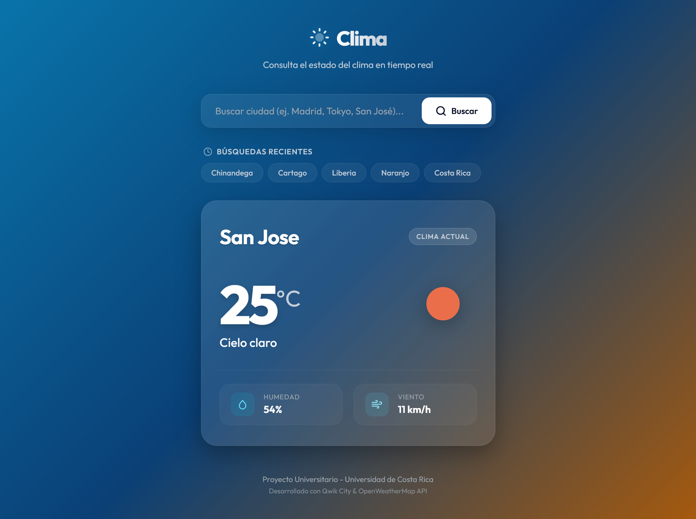
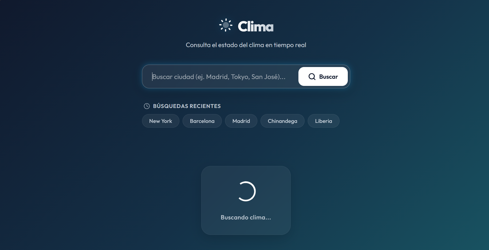
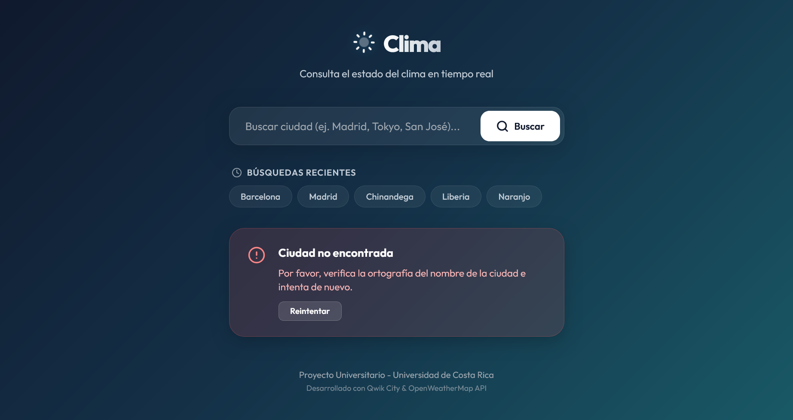

# Aplicación del Clima en Qwik

Proyecto universitario desarrollado para la materia de Ingeniería de Software (Universidad de Costa Rica). Una aplicación del clima responsiva, moderna y ultra rápida construida con el framework reactivo **Qwik**, **Qwik City** y la API de **OpenWeatherMap**.

---

## URL de la Demo en Vivo

Puedes ver y probar la aplicación en producción aquí:
**[Enlace de la Demo en Vercel](https://qwik-grupo-8.vercel.app/)**

---

## Framework Usado

Para el desarrollo de esta aplicación se utilizó **Qwik (v1.20.0)** y **Qwik City**:
*   **Qwik:** Es un framework de frontend diseñado para ofrecer un rendimiento óptimo de carga mediante una arquitectura de **Resumabilidad (Resumability)**, eliminando la necesidad de hidratación en el cliente.
*   **Qwik City:** El framework de meta-páginas oficial de Qwik que proporciona enrutamiento basado en archivos, renderizado en el servidor (SSR) y funciones seguras en el servidor como `server$`.

---

## Características Implementadas

*   **Buscador de ciudades:** Formulario que permite consultar el clima ingresando el nombre de una ciudad (ejecutable con el botón "Buscar" o presionando la tecla "Enter").
*   **Visualización en tiempo real:** Despliegue de temperatura actual (redondeada en °C), descripción climatológica detallada en español (capitalizada), iconos dinámicos oficiales y secciones secundarias para la humedad (%) y velocidad del viento (km/h).
*   **Fondo Dinámico:** El gradiente de fondo de la app cambia de color según el clima actual de la ciudad seleccionada para mejorar el impacto visual (Clear, Clouds, Rain, Storm, Snow, Mist).
*   **Historial de Búsquedas Recientes:** Lista con las últimas 5 ciudades buscadas en forma de botones rápidos que ejecutan búsquedas al hacer clic sobre ellas.
*   **Persistencia en LocalStorage:** El historial de ciudades se almacena y recupera desde el `localStorage` del navegador para que los datos se mantengan al recargar la página.
*   **Estado de Carga (Loading):** Spinner animado en CSS puro que bloquea la interfaz de forma no-bloqueante al hacer fetch, manteniendo al usuario informado.
*   **Control de Errores Robustos:** En caso de buscar una ciudad que no existe o sufrir un corte de red, el sistema captura la respuesta 404 y despliega un panel amigable que dice `"Ciudad no encontrada"` junto con un botón para reintentar la búsqueda.

---

## Setup e Instalación Local

### Requisitos previos
*   Tener instalado [Node.js](https://nodejs.org/) (versión 18.17.0, 20.3.0 o superior).

### Instrucciones de ejecución:

1.  **Clonar o descargar el proyecto:**
    Abre tu terminal en la carpeta del repositorio:
    ```bash
    cd Qwik-Grupo-8
    ```
2.  **Instalar las dependencias de Node:**
    ```bash
    npm install
    ```
3.  **Iniciar el servidor de desarrollo:**
    ```bash
    npm start
    ```
4.  **Abrir en el navegador:**
    Ingresa a [http://localhost:5173/](http://localhost:5173/)

---

## Cómo Configurar la API Key Localmente

La aplicación utiliza la API de OpenWeatherMap. Para poder hacer consultas en local de forma segura:

1.  Regístrate de forma gratuita en [OpenWeatherMap](https://openweathermap.org/) y obtén tu API Key de 32 caracteres.
2.  Crea un archivo llamado `.env` en la raíz de tu proyecto.
3.  Añade tu clave privada dentro del archivo de esta forma:
    ```env
    OPENWEATHER_API_KEY=tu_api_key_aqui
    ```
> **Importante:** El archivo `.env` está en el `.gitignore`. Nunca subas tu clave privada públicamente a GitHub. Al desplegar a producción en Vercel, debes agregar esta misma clave en la sección **Environment Variables** en el panel de control de Vercel.

---

## Conceptos Clave de Qwik Aplicados

*   **Resumabilidad (Resumability):** A diferencia de React o Vue que necesitan descargar todo el Javascript y reconstruir el DOM (Hidratación), Qwik pausa la ejecución en el servidor y la resume en el cliente sin descargar código Javascript hasta que el usuario interactúa.
*   **Server$ (RPC):** Hook exclusivo de Qwik. Define funciones que se ejecutan únicamente en el servidor. Lo utilizamos en `fetchWeather` para que la llamada a la API y el uso de la API Key secreta ocurra en el servidor sin exponerse al navegador.
*   **useSignal y useStore:** Hooks de estado reactivo. `useSignal` se emplea para variables primitivas individuales (como la ciudad activa), y `useStore` para objetos o arreglos reactivos complejos (como el historial y los datos del clima).
*   **useTask$ Híbrido:** Se ejecuta en SSR para pre-renderizar la primera ciudad y en el cliente de manera asíncrona para actualizar la información sin bloquear ni congelar la pantalla.
*   **preventdefault:submit:** Directiva síncrona interpretada por el Qwikloader para interceptar de inmediato el formulario y prevenir que el navegador recargue la página web antes de que el archivo JS de lógica se descargue.

---

## Pros y Contras de Qwik

### Pros:
*   **Rendimiento Extraordinario:** Carga instantánea e Interactividad en milisegundos debido a que casi no descarga JavaScript en el arranque.
*   **Optimización SEO nativa:** Al ejecutarse con Server-Side Rendering (SSR), el HTML llega completamente pre-renderizado con los datos del clima, facilitando el rastreo de buscadores.
*   **Seguridad Out-of-the-Box:** Integración nativa servidor-cliente (`server$`) que simplifica la ocultación de secretos y tokens.

### Contras:
*   **Curva de aprendizaje:** La sintaxis y la obligación de serializar datos mediante `$()` resulta compleja al inicio para desarrolladores habituados a React clásico.
*   **Ecosistema reducido:** Menor disponibilidad de librerías y componentes pre-hechos de terceros en comparación con ecosistemas gigantes como React, Angular o Vue.

---

## Capturas de Pantalla (Manual de Usuario Visual)

### 1. Vista General (Carga de Ciudad por Defecto)


### 2. Animación de Carga (Spinner)


### 3. Vista de Error (Ciudad No Encontrada)
